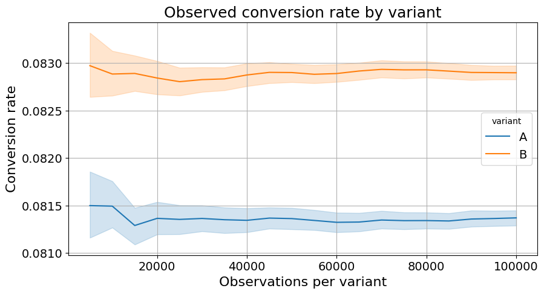
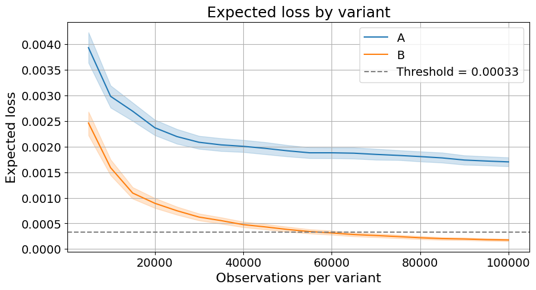
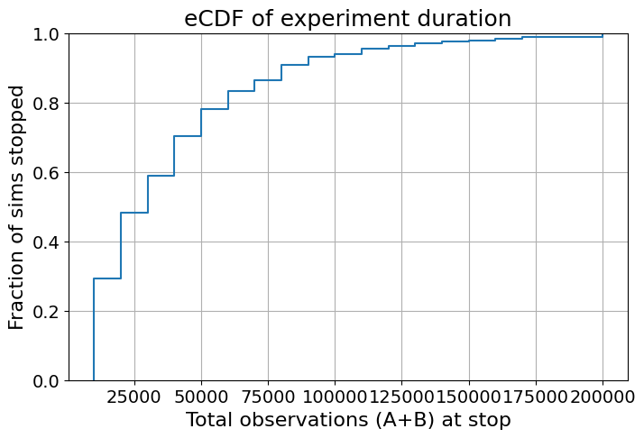
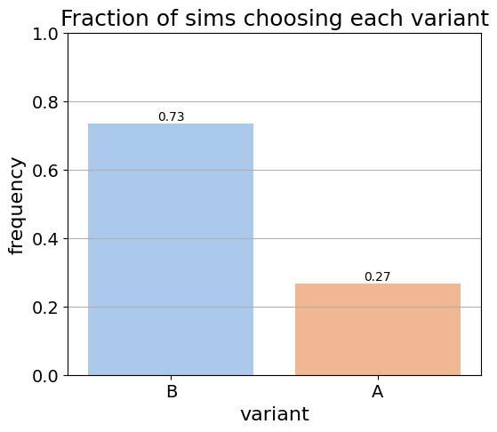

# On Ways To Optimize A/B Testing in Low-conversion Marketing Funnels 

# Background

Traditional A/B testing( Frequentist fixed-horizon approach) is unsuitable for low-traffic marketing funnels, especially when conversion rates are low. Businesses would waste weeks waiting for enough data to make a decision — only to end up with results that are statistically unclear or hard to act on.

This thesis explores how Bayesian approaches with informed priors can help reduce test duration, while keeping results interpretable and aligned with business risk.

---

# Solution

We compare several Bayesian setups (with weak, mid, and strong priors) against a Frequentist baseline(real-world tests, closed by Frequentist approach).

Our main focus:
- Compare the sample size, required for the test and how Bayesian approach minimizes it
- Investigate how threshold analysis impacts sample size
- Incorporate prior knowledge(weak, mid and strong priors) and compare their impact.

---

# Data

The dataset consists of 54 Real A/B tests in `thesis_data`, with:
- `distribution_df` file with information about traffic and metrics distributions
- `final_anonimous_dataset` with information about conversion rates per variation and test metadata( PSVS is a target metric)
- `final_anonimous_SCS_dataset`same as previous, with SCS as a target metric
- `final_anonimous_sequential_dataset` contains cumulative conversins per day of the test


To preprocess data, `for_data.ipynb` file was used. The data is anonimized due to NDA, therefore this file cannot be run again, as there is no raw data attached.

`results_data` contains files with saved simulations and sample sizes extimations.

---

# 🔁 How to Reproduce?

```bash
# Clone this repo
git clone https://github.com/smorya/thesis.git

# (Optional ) Set up a clean environment
python -m venv venv
source venv/bin/activate  # or .\venv\Scripts\activate on Windows

# Install dependencies
pip install -r requirements.txt

# Run main experiments file
Experiments.ipynb

```

# Details on usage of `Experiments.ipynb` file
The file contains several chunks:
1. Import of processed data
2. Theory functions
3. Computed and updates frequentist stats
4. Visualizations for traffic and metrics data analysis
5. Bayesian models chunk with helper functions
6. Prior estimation helper functions
7. Simulations chunk - IMPORTANT!
- you can either simulate data(which would take 1,5hrs approx overall) or download them with function `load_simulated_exps_from_pickle`
8. Plot experiments chunk - with visuals about simulations as below
9. Results chunk - also could be simulated(1.5 hrs approx each simulation), or downloaded with function `load_simulation_results`

# Visuals of the one test simulation





